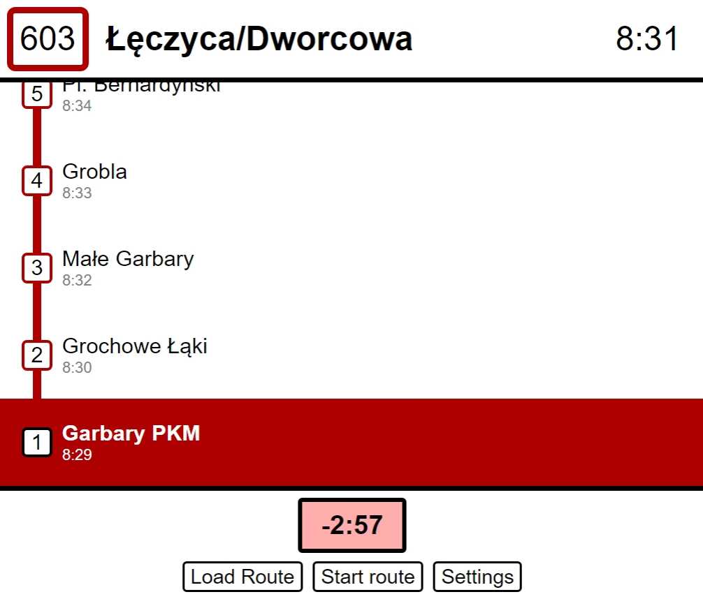
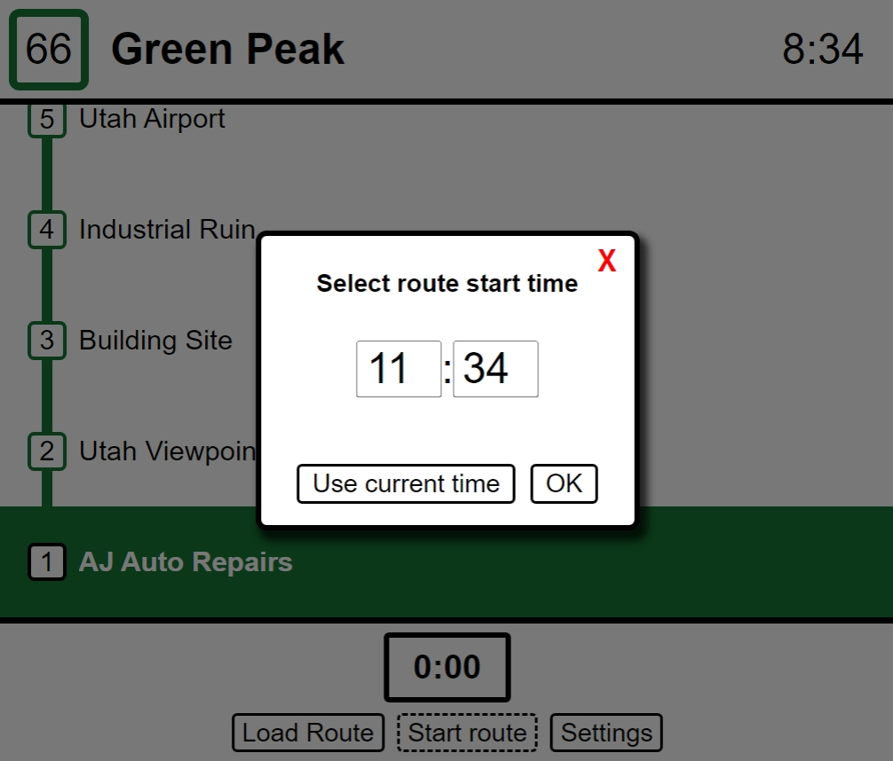

# Driver's timetable
This simple local web app can assist you in following a timetable, whether it's a bus route, a train timetable, or anything else you can imagine. The routes are read from text files, and are easy to customize for any needs.

The page is responsive. You may use it on mobile, desktop, a tablet, or any device. It only requires a basic browser with JS support. No libraries, no npm things.

## Usage
Open up the page, and click on **Load Route**. Select a .txt file (see [samples folder](samples) for documentation), and select a start time for the route. After that, departure times for stops will be calculated. The next stop will always appear with a color background on the bottom.

To advance to the next stop as you're done with the current one, click on the timer button. The timer shows time until departure.

## Screenshots

Sample route, 3 min late for the departure

---

Route start time picker

## Demo
Check out the demo [here](???).