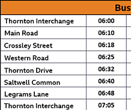

# Route files
Route files are saved in txt files. Name does not matter

## Format
The route file should look as follows:

```
lineNumber
destination
primaryColor textColorOnPrimary

stopTime; stopName
stopTime; stopName
(etc...)
```

## Values
`lineNumber` - can have any UTF-8 characters.

`primaryColor` - main theme color of the route.

`textColorOnPrimary` - color of the text situated on the primary color, i.e. text on the current stop. Usually white or black, depending on the primary color.

**All colors [accepted by CSS](https://www.w3schools.com/cssref/css_colors_legal.php) are valid. Remember to precede hex colors with a hashtag, e.g. #ffffff**

`stopTime` - time of the departure expressed in minutes, in offset to the selected route start time (not to the previous stop).

`stopName` - name of the stop. May contain spaces. Will be automatically shortened if too long.

## Other
- Empty lines are ignored
- Lines starting with `/` are comments, and are ignored
- You can use half-minutes, e.g. `1.5`, but the seconds won't appear under the stop name. The timer will count the seconds correctly
- Don't add more than 9999 stops (why would you?☠)

## Example
For example, to write the following:



[*Image source*](https://www.bbc.co.uk/bitesize/articles/z4dgvwx)

Assume the route is **T1 -> Thornton Interchange**.

```
T1
Thornton Interchange
#e78025 black

0; Thornton Interchange
10; Main Road
18; Crossley Street
25; Western Road
32; Thornton Drive
40; Saltwell Common
48; Legrams Lane
65; Thornton Interchange
```
file: [t1.txt](t1.txt)

`#e78025` is the orange color seen at the top of image, and `black` is the text color.

Then, if you start the route at 6:00, you will get the exact timetable as on image.